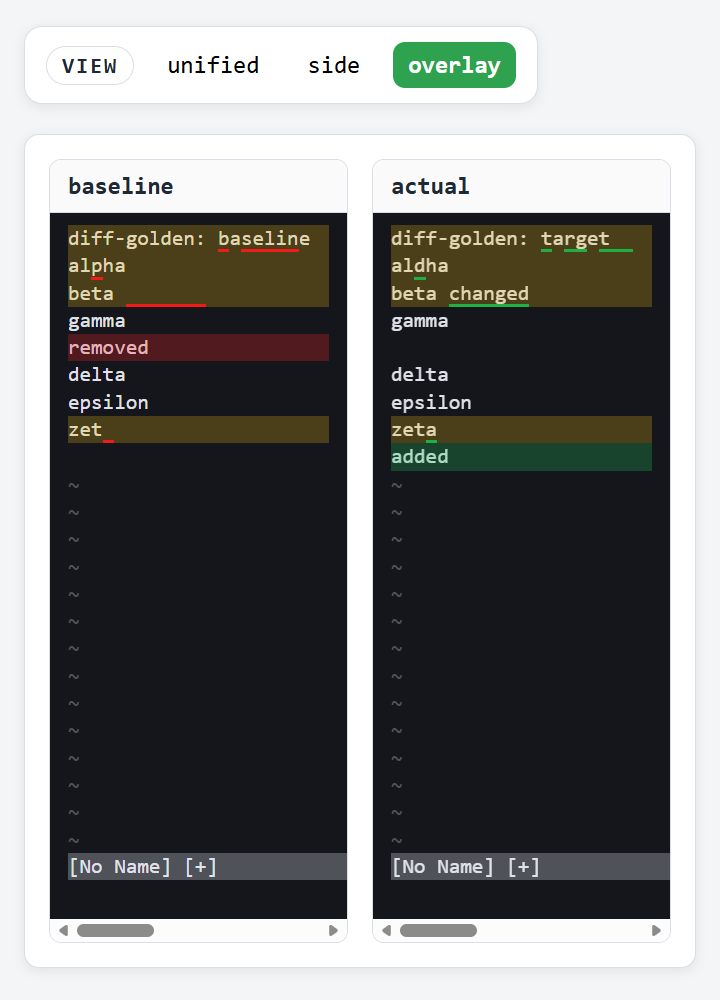

# nvim-snap

nvim-snapは、NeovimのUIスナップショットに基づくテストを実行できるようにするためのツールです。

## コンセプト

シナリオを実行してUIスナップショットを生成し、結果を比較する。
リグレッションはコミット単位で保存した結果同士を比較し、ゴールデンは同一実行内でgolden/targetを比較する。

## 例



このリポジトリ内に `snapcase-example` を同梱しているので、そのままケースを実行して動作を確認できます。
既定では `--root` はカレントディレクトリ、`--cases-dir` は `snapcase/` です。
ケースは `<root>/<cases-dir>/regression/<case-name>/snapcase.json` または
`<root>/<cases-dir>/golden/<case-name>/snapcase.json` に置きます。
出力は `<root>/<cases-dir>/.result/` に保存します。

## インストール

### 依存関係

- Neovim（`nvim`）
- PNG出力に `google-chrome`/`chromium`/`msedge`/`wkhtmltoimage`

### リリースから取得

リリースページの `nvim-snap` をダウンロードして PATH に置いてください。

### ソースからビルド

```sh
go build -o nvim-snap ./cmd/nvim-snap
```

### mise での利用

```sh
mise use github:kyoh86/nvim-snap
```


## コマンド

ケースは `snapcase/regression/<case-name>/snapcase.json` または
`snapcase/golden/<case-name>/snapcase.json` に配置します。
ケース名はディレクトリ名で決まり、`snapcase.json` にメタデータと取得設定を記述します。
`snapcase.json` の `rtp` は文字列または配列で、runtimepathに追加するパスを指定します。
`${CASE}`（ケースディレクトリ）と `${ROOT}`（`--root` のパス）のプレースホルダが使えます。

- `list` テストケース一覧
- `init` CI向けワークフロー雛形の作成
- `capture` シナリオからスナップショットを取得
- `normalize` スナップショットJSONを正規化
- `compare` スナップショットJSONを比較
- `regression new` リグレッションケース雛形の作成
- `regression save` コミット単位で保存
- `regression test` 保存済みスナップショットの比較
- `golden new` ゴールデンケース雛形の作成
- `golden test` ゴールデン/ターゲットの比較

### list

テストケースを一覧表示します。

```sh
nvim-snap list
nvim-snap list --tag ui --tag regression
nvim-snap list --case basic-regression
nvim-snap list --json
```

### capture

シナリオからスナップショットを取得します。

```sh
nvim-snap capture --scenario scenario.lua --out ./out --format json,ansi,html
```

### normalize

スナップショットJSONを正規化します。

```sh
nvim-snap normalize --in snapshot.json --out normalized.json
nvim-snap normalize --in snapshot.json
```

### compare

スナップショットJSONを比較します。

```sh
nvim-snap compare --expected expected.json --actual actual.json --format text
nvim-snap compare --expected expected.json --actual actual.json --format html --out diff.html
```

### regression new

リグレッションケースの雛形を作成します。

```sh
nvim-snap regression new --name basic-regression
```

`--name` を省略するとランダムなケース名を生成し、`<root>/<cases-dir>/regression/` 配下にディレクトリを作成します。

### regression save

現在のコミット（既定）でスナップショットを保存します。

```sh
nvim-snap regression save
nvim-snap regression save --id abcdef1234
nvim-snap regression save --tag ui
```

### regression test

保存済みスナップショットを比較します。
`--target` を省略すると現在のコミットIDを使います。

```sh
nvim-snap regression test --base abcdef1234 --target 0123456789
nvim-snap regression test --base abcdef1234 --output diff --diff-format text
```

### golden new

ゴールデンケースの雛形を作成します。

```sh
nvim-snap golden new --name sample-golden --title "Sample Golden"
```

### golden test

golden/targetを実行して比較します。

```sh
nvim-snap golden test --output summary --diff-format html
nvim-snap golden test --output diff --diff-format text --diff-always
```

### init

CI向けワークフロー雛形を作成します。

```sh
nvim-snap init --path .github/workflows/nvim-snap.yml
```

## 実用時の流れ

### リグレッションの流れ

1. リグレッションケースを作る  
   `nvim-snap regression new --name my-case`
2. シナリオを書く  
   `scenario.lua`
3. ベースコミットで保存  
   `nvim-snap regression save`
4. ターゲットコミットで保存  
   `nvim-snap regression save`
5. 比較  
   `nvim-snap regression test --base <base-id> --target <target-id>`

CIでは、ベース側のスナップショットが存在する前提になるため、`.result/` のキャッシュ利用などで用意してください。

### ゴールデンの流れ

1. ゴールデンケースを作る  
   `nvim-snap golden new --name my-case`
2. シナリオを書く  
   `golden.lua` / `target.lua`
3. 実行と比較  
   `nvim-snap golden test --output summary --diff-format html`

## テストの種類

- リグレッション: 同一シナリオの結果をコミット単位で保存し比較する
- ゴールデン: golden/targetを同一実行で比較する

## 注意点

- 出力は `<root>/<cases-dir>/.result/` に保存されます。
- `regression save` は既定で現在のGitコミットIDを使い、作業ツリーがdirtyだとエラーになります。
- シナリオの中でプラグインが必要な場合は、 `vim.pack.add()` を使うのがおすすめです。
- `vim.pack.add()` を使う場合は `snapcase.json` の `data_home` / `config_home` を明示的に設定してください。
- Golden の実行では、設定した `data_home` / `config_home` の下でシナリオごとに分離します。
- headless実行では入力待ちが発生するコマンドが止まることがあります。`vim.cmd` より `vim.api.nvim_cmd` を推奨します。
- `wait_done` を使う場合は `require("nvim_snap").done()` を呼び出してください。
